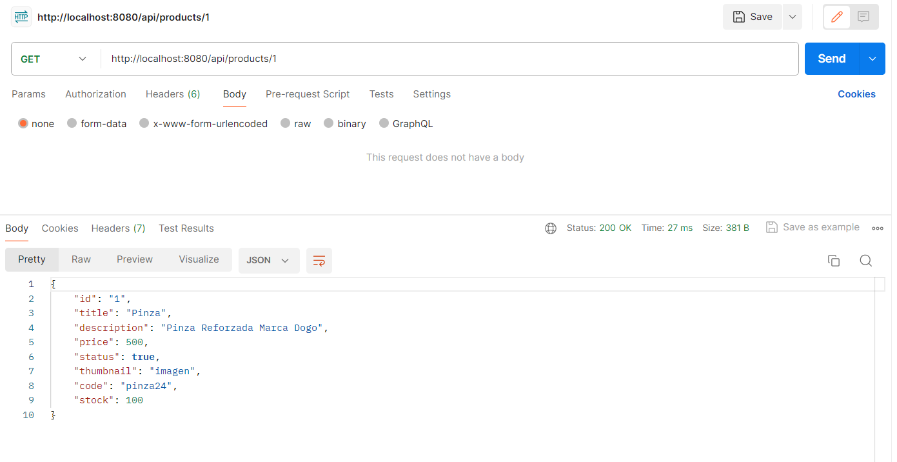
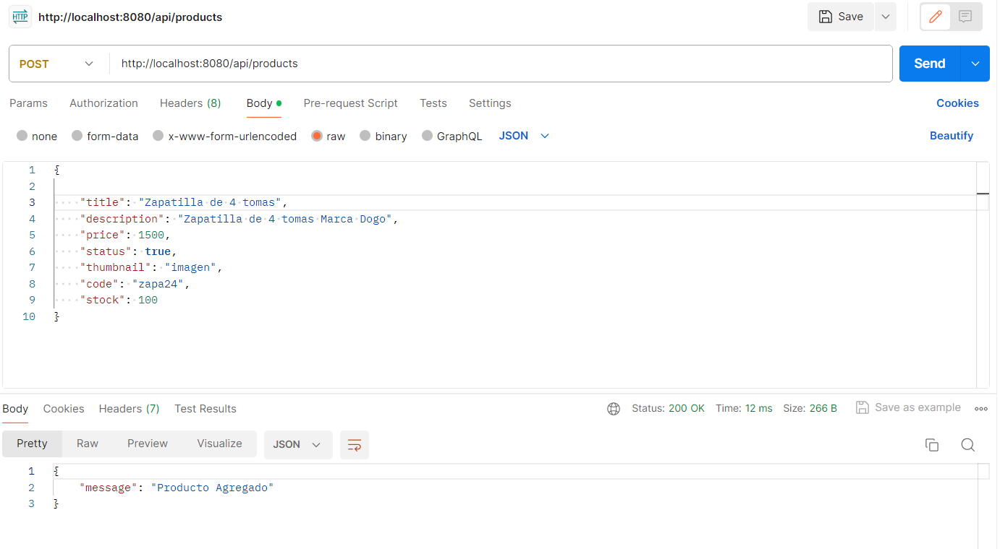
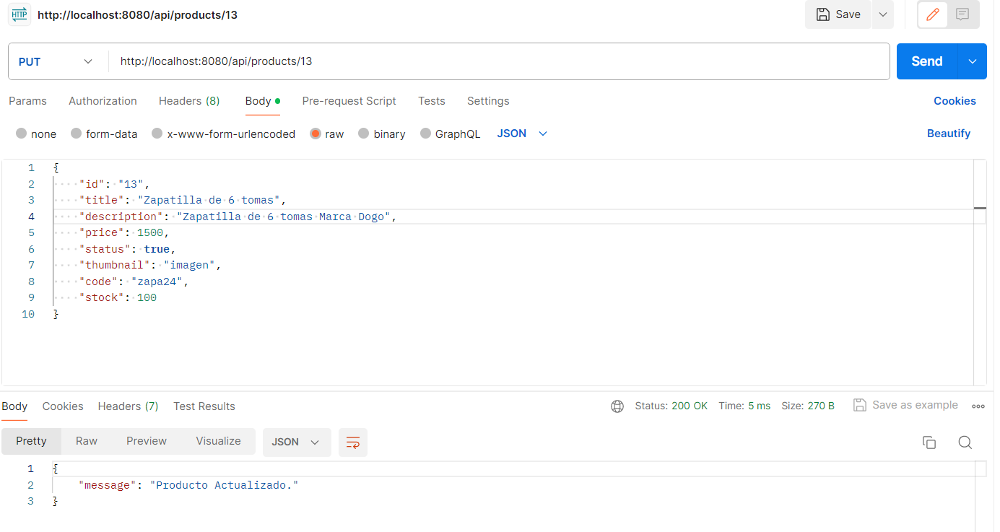
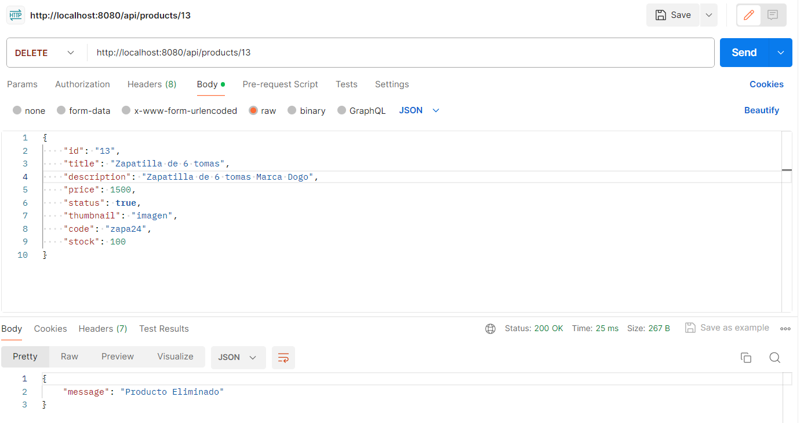
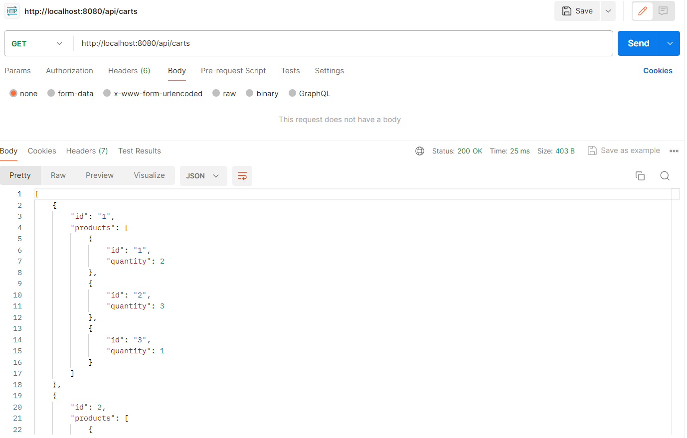
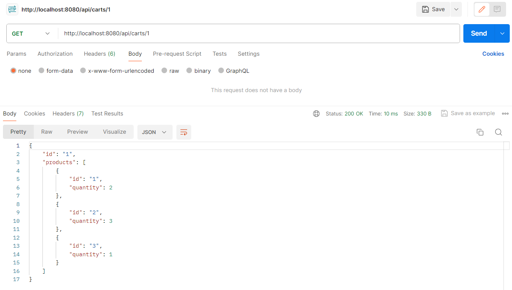
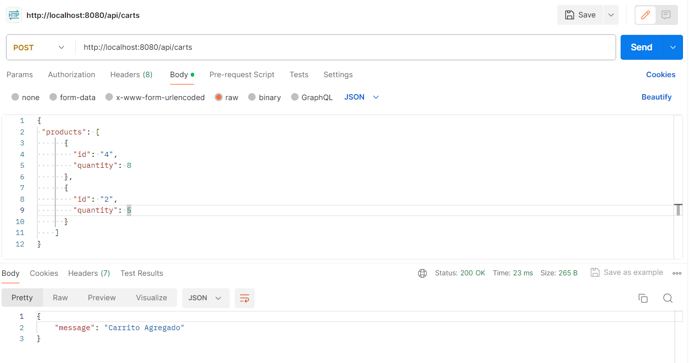
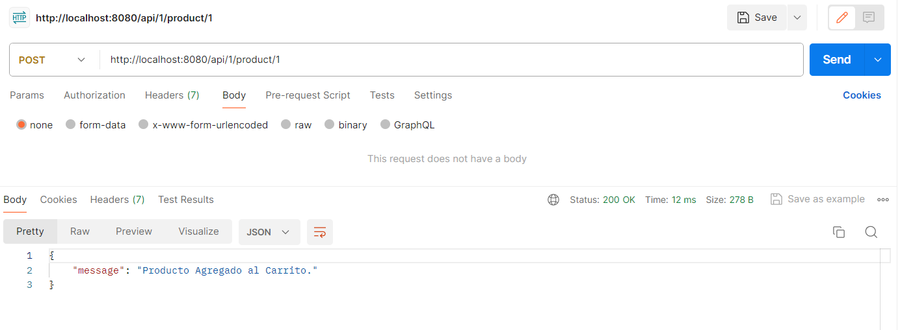

# Primer PreEntrega
## Ejecución del proyecto
### npm start

## Prueba de Productos
### En postman, consultar todos los productos: Metodo: GET y URL= http://localhost:8080/api/products

### Consultar producto por id: Metodo=GET y URL=http://localhost:8080/api/products/1

### Agregar producto: Metodo=POST y URL=http://localhost:8080/api/products

### Actualizar producto: Metod=PUT y URL=http://localhost:8080/api/products/13
 
### Eliminación de producto: Metod=DELETE y URL=http://localhost:8080/api/products/13

## Prueba de Carrito
### En postman, consultar todos los carritos: Metodo=GET y URL= http://localhost:8080/api/carts

### Consultar  un carrito: Metodo=GET y URL= http://localhost:8080/api/carts/1

### Agregar un nuevo carrito: Metodo=POST y URL= http://localhost:8080/api/carts

### Agregar producto a un carrito existente: Metodo=POST y URL= http://localhost:8080/api/1/product/1
